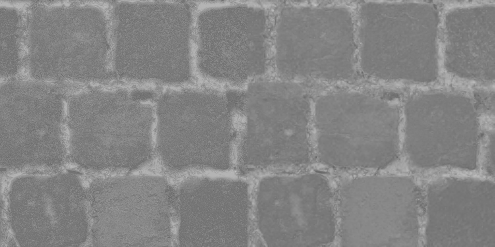
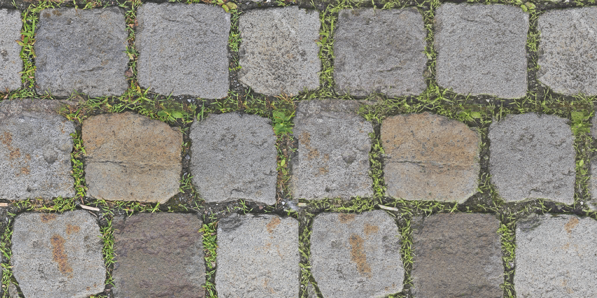
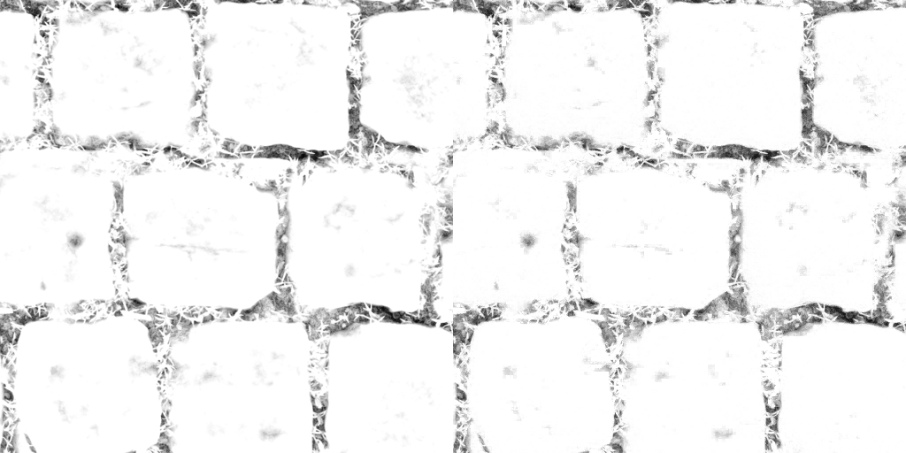
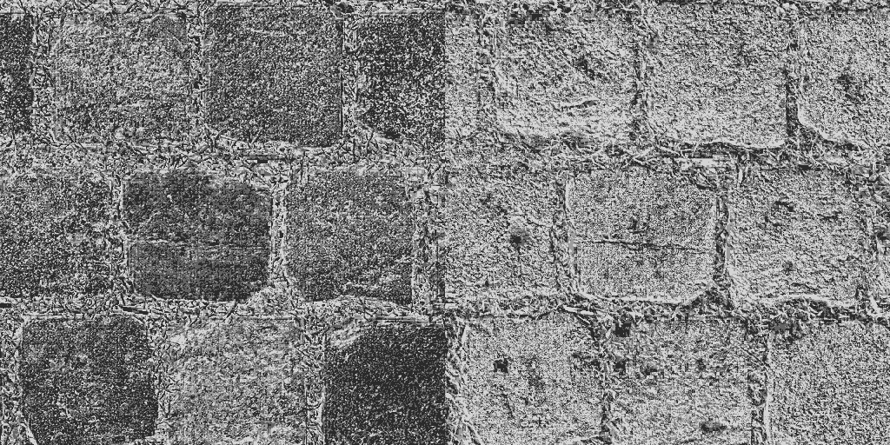

# Neural block texture compression trained with Evolution Strategies (ES)

_Code, README, and public Prior Art disclosure By Richard Geldreich, Jr., September 5, 2026, email: richgel99 at gmail.com, X: https://x.com/richgel999/_

Note the example/test .PNG images in this repo are not covered by the [Unlicense](https://unlicense.org/), which applies to all the other files: source code, build scripts, this README etc.

A small, self-contained C++ testbed: an RGB image (or up to four same-size
RGB textures of one material) is encoded as a shared low-resolution latent
texture plus a tiny MLP decoder, and both are trained
**entirely with Evolution Strategies** — no backprop, no autodiff, no
training framework. (An optional late-training polish, `--mlp-fd`, switches
the decoder to numerical finite differences; still no backprop.) Dependencies are `stb_image`, `stb_image_write`, and OpenMP.

Write-up: [Fitting a neural texture decoder with ES](https://richg42.blogspot.com/2026/09/fitting-neural-texture-decoder-with-es.html)

```
I(u,v) ≈ MLP( bilinear(Z, u, v), phi(u,v) )
```

`Z` is the latent texture, `phi` a small positional encoding. At decode time
each pixel bilinearly samples `Z` at its UV, appends `phi`, and runs the MLP.
An optional second, coarser latent level (`--latent2`) is sampled at the same
UV and its channels are concatenated onto the first level's. Either level can
instead be sampled nearest-neighbor (`--filter`), which turns it into a block
format; with `--qat B` the first level becomes a per-pixel B-bit selector
chosen by exhaustive search (see [A learned block format](#a-learned-block-format)).

## Results

512×512 crop of kodim23, 3000 iterations, latent quantized to 8 bits after
training, MLP weights counted as fp16:

| Latent      | PSNR    | bpp (raw) | bpp (entropy coded) |
|-------------|---------|-----------|---------------------|
| 64×64×4     | 26.9 dB | 0.56      | 0.47                |
| 64×64×8     | 28.2 dB | 1.07      | 0.87                |
| 128×128×4   | 30.3 dB | 2.06      | 1.65                |
| 128×128×8   | 32.2 dB | 4.07      | 3.27                |

These runs used the original positional encoding `uv,fourier:1` (`--nfreq 1`),
which is why the evaluation command below passes it. The current default is
`uv` only, which scored 0.26–0.32 dB higher where both were run (see
METHOD.md); the results quoted later in this file use that default unless
stated otherwise.

The 128×128×8 run uses a 14 → 24 → 24 → 3 MLP (1035 weights, leaky ReLU,
sigmoid output) and trains in about 150 s on a 32-thread CPU. Quantizing the
latent to 8 bits costs 0.04 dB.

Output of that run (`out_128c8/`): target crop, reconstruction after 3000
iterations, and the eight latent channels side by side.

| Target | Reconstruction (32.2 dB) |
|--------|--------------------------|
|  |  |


`out_128c8/model.bin` is the trained model; evaluate it with
`ntc kodim23.png --load out_128c8/model.bin --latent 128 128 8 --nfreq 1 --iters 0`.

### A 4-layer material

The PavingStones070 material (normal, roughness, albedo, AO; see
[Test images](#test-images)) trained jointly from one shared 128×128×4 +
64×64×4 latent and one 10 → 36 → 36 → 12 MLP (2172 weights), 3000
iterations, learning rate annealed over the second half, per-weight finite
differences for the decoder over the last quarter. 8-bit latent: 2.64 bpp
total, 0.66 bpp per texture. Left is the target, right the reconstruction
from the quantized latent (`out_m1234/`). The training command was

```
ntc m1.png m2.png m3.png m4.png --latent 128 128 4 --latent2 64 64 4 --mlp 36,36 --mlp-pairs 64 --iters 3000 --lr-anneal 0.5 0.05 --mlp-fd 0.75 --out out_m1234
```

| Normal map, 23.2 dB |
|---|
|  |

| Roughness, 31.5 dB |
|---|
|  |

| Albedo, 23.2 dB |
|---|
|  |

| Ambient occlusion, 29.6 dB |
|---|
|  |

`out_m1234/model.bin` is the trained material; evaluate it with
`ntc m1.png m2.png m3.png m4.png --load out_m1234/model.bin --latent 128 128 4 --latent2 64 64 4 --mlp 36,36 --iters 0`.

### A learned block format

All runs in this section: mario_512, 36,36 decoder, 64 MLP pairs, 3000
iterations, learning rates annealed 1× → 0.05× over the second half,
per-weight finite differences for the decoder over the last quarter
(`--mlp 36,36 --mlp-pairs 64 --iters 3000 --lr-anneal 0.5 0.05 --mlp-fd 0.75`),
latent quantized to 8 bits after training unless stated otherwise.

**Nearest sampling.** With `--filter nearest` every pixel of a latent cell
reads the same texel, so a 128×128 latent on a 512×512 image is a 4×4-block
format: 128×128×8 at 8 bits is 64 bits per 4×4 block, 4 bpp, BC1's rate.
Footprints are disjoint, so the ES attribution is exact. The decoder needs a
cell-position feature (`local`, `ldct:N`, `lv1local`, ...) or the whole cell
decodes to one color. Nearest costs a lot against bilinear at the same
bitrate: 128×128×8 with `uv,local` reaches 28.89 dB at 4.12 bpp where the
bilinear `uv` run reaches 31.64 dB at 4.06 bpp.

**In-loop deblocking.** `--deblock` applies a Basis Universal / KTX2 Studio
style 5-tap cross filter at the level-0 block edges inside every loss
evaluation. It is content-blind; the decoder learns to pre-compensate for
it. The footprint attribution is dilated across block boundaries so the
latent ES estimate stays unbiased. About 3× slower (544 s → 1700 s).

```
ntc mario_512.png --latent 128 128 8 --filter nearest --pos uv,local --deblock --mlp 36,36 --mlp-pairs 64 --iters 3000 --lr-anneal 0.5 0.05 --mlp-fd 0.75 --out out_near_128c8_deblock
```

| Latent (nearest) | `--pos`    | no deblock | `--deblock` | bpp (raw) |
|------------------|------------|------------|-------------|-----------|
| 128×128×8        | `uv,local` | 28.89 dB   | 29.71 dB    | 4.12      |
| 128×128×4        | `local`    | 26.63 dB   | 27.64 dB    | 2.10      |

(128×128×4 with `uv,local` and deblocking: 27.37 dB.)

**Block-position bases.** Richer per-pixel position inputs for the decoder
on the nearest 128×128×4 latent, no deblocking, fp32 PSNR:

| `--pos`                     | PSNR     |
|-----------------------------|----------|
| `local`                     | 26.67 dB |
| `local`, `--leak 1/1024`    | 26.69 dB |
| `bdct:2`                    | 26.59 dB |
| `bdct:5`                    | 26.48 dB |
| `bdct:15`                   | 26.19 dB |
| `local,onehot`              | 26.45 dB |
| `local,bc7part:16`          | 26.20 dB |

A 5000-iteration variant without the finite-difference phase (anneal from
50%, leak 1/1024): `local` 26.51 dB, `local,bdct:5` 26.55 dB. None of the
richer bases helped: `onehot` is the upper bound on any position basis
(every other one is a linear function of it) and it lost 0.2 dB. The block
latent, 4 scalars per 4×4 block, lacks per-pixel information; decoder
expressiveness is not the limit.

**Two levels, filter per level.** 128×128×4 + 64×64×4, `--pos local`,
2.61 bpp, fp32 PSNR: nearest/nearest 27.68 dB, nearest/bilinear 28.56 dB,
bilinear/bilinear 30.59 dB.

**A per-pixel level.** Making level 0 one scalar per pixel and level 1 the
block latent (`--latent 512 512 1 --latent2 128 128 4 --filter nearest,nearest --pos lv1local`)
reaches 34.77 dB (34.61 dB at 8 bits) but at 10.11 bpp raw (7.75 entropy
coded), and post-hoc quantization of the trained float level 0 collapses:
24.40 / 10.74 / 9.06 dB at 4 / 2 / 1 bits. The per-pixel values have to be
discrete during training.

**`--qat B`: a per-pixel selector level.** Level 0 is held on a fixed
2^B-value grid in [-1, 1] and updated by an exact exhaustive per-texel
search: each texel is set to the grid value that minimizes the weighted error
over its cell. With nearest sampling and no deblocking each pixel reads one
level-0 texel, so the search is exact, and ties keep the current value, so
the loss never increases. It costs C0·2^B image decodes per search. Level 1
and the MLP train by ES and finite differences as before. The result is a
learned block format: per-pixel B-bit indices plus a per-block latent and a
tiny MLP, the indices chosen the way a BC encoder chooses its indices, the
decoder and the block latent trained by ES. Bitrate charges level 0 at B
bits, with the entropy taken over the grid indices.

```
ntc mario_512.png --latent 512 512 1 --latent2 128 128 4 --filter nearest,nearest --pos lv1local --qat 2 --mlp 36,36 --mlp-pairs 64 --iters 3000 --lr-anneal 0.5 0.05 --mlp-fd 0.75 --out out_2lv_512c1_128c4_qat2
```

512×512×1 at B bits + 128×128×4 nearest at 8 bits, PSNR of the 8-bit
evaluation:

| Level 0                | PSNR     | bpp (raw) | bpp (entropy coded) |
|------------------------|----------|-----------|---------------------|
| none (128×128×4 only)  | 26.63 dB | 2.10      | 1.74                |
| `--qat 1`              | 28.02 dB | 3.11      | 2.76                |
| `--qat 2`              | 30.76 dB | 4.11      | 3.74                |
| `--qat 3`              | 32.64 dB | 5.11      | 4.72                |
| `--qat 4`              | 33.69 dB | 6.11      | 5.67                |
| float, 8 bits post hoc | 34.61 dB | 10.11     | 7.75                |

For reference, bilinear 128×128×8 with `uv` gives 31.64 dB at 4.06 bpp, so
at BC1's rate the 2-bit selector format is still 0.9 dB behind the plain
bilinear latent, and 1.9 dB ahead of the nearest 128×128×8 block latent
without a selector level (28.89 dB).

The same 2-bit format on the 4-layer material (one shared selector level and
block latent for all four textures):

```
ntc m1.png m2.png m3.png m4.png --latent 512 512 1 --latent2 128 128 4 --filter nearest,nearest --pos lv1local --qat 2 --mlp 36,36 --mlp-pairs 64 --iters 3000 --lr-anneal 0.5 0.05 --mlp-fd 0.75 --out out_m1234_512c1q2_128c4
```

| Material run                        | bpp / texture | Normal   | Roughness | Albedo   | AO       | Total    |
|-------------------------------------|---------------|----------|-----------|----------|----------|----------|
| bilinear 128×128×4 + 64×64×4 (above) | 0.66         | 23.17 dB | 31.48 dB  | 23.22 dB | 29.55 dB | 25.45 dB |
| `--qat 2` 512×512×1 + 128×128×4     | 1.03          | 23.37 dB | 31.61 dB  | 27.26 dB | 31.59 dB | 27.06 dB |
| `--qat 4` 512×512×1 + 128×128×4     | 1.53          | 23.74 dB | 32.10 dB  | 29.41 dB | 33.24 dB | 27.92 dB |
| `--qat 4` 512×512×1 + 128×128×6     | 1.78          | 24.52 dB | 32.82 dB  | 30.05 dB | 33.93 dB | 28.66 dB |

Raw totals 4.13, 6.13 and 7.13 bpp; entropy coded 3.72, 5.62 and 6.17 bpp (0.93,
1.40 and 1.54 per texture). Albedo and AO gain the most from the per-pixel level;
the normal map barely moves.

### Neural block texturing

The format above, run on the GPU with multi-channel selectors of per-channel
bit depth (`--qat B1,B2,...`) and a longer schedule. Every result here was
trained on an RTX 5090 (`--cuda`) except where marked CPU; the two paths
agree to within seed noise (and to display precision when the CPU trainer
draws the same hash noise, `--rng hash`).

Test platform for every result in this section: NVIDIA GeForce RTX 5090
(32 GB, driver 581.80), CUDA 13.1 (nvcc 13.1.80, sm_120), Windows 11 Pro
(build 26200), Visual Studio 2022 Community (MSVC 19.44 / toolset 14.44,
the host compiler for nvcc), CMake 4.1.1; the CPU numbers quoted for
comparison are from the same machine on the CPU: AMD Ryzen 9 9950X (16 cores, 32 threads), 64 GB RAM, same MSVC build.

**The format.** A 4×4 block is a fixed-size record: `B = (c_b, s_0 ... s_15)`.
`c_b` is the block's latent (C1 values at 8 bits, the "block control"), and
each `s_i` is that pixel's selector (C0 small integers of B0 bits each). A
pixel is reconstructed as

```
x_i = f_theta( c_b, s_i, u_i, v_i )
```

by one MLP evaluation from its block latent, its own selector(s) and its
position inside the block (`lv1local`, the 4×4 cell offset in [-1,1]). For a
material `f_theta` emits every texture's channels at once from the same
record. The block latent is trained by ES with footprint attribution, the
selectors are chosen by exact exhaustive search every iteration, the
decoder by ES then per-weight central finite differences. Nothing is
backpropagated.

**Blocks are self-contained packets.** Because the selectors are sampled
nearest and the block latent is one texel per block, everything a block's
16 texels need is in its own record: the 8-bit block values followed by
the 16 packed selectors (48 to 112 bits per block in the runs below). The
records can be stored as a flat array in block order, like BC or ASTC
blocks, and any block can be read and decoded on its own, in any order, in
parallel, with no neighbor access and no latent texture or grid at all.
The "two latent levels" are only how the trainer holds the same data
while it is being optimized; a decoder needs nothing but the packet and
the shared MLP weights.

**Sample: chief1.png** (512×512 game texture), 2-bit selectors and a
2-channel block latent, 48 bits per 4×4 block:

```
ntc chief1.png --cuda --latent 512 512 1 --latent2 128 128 2 --filter nearest,nearest --pos lv1local --qat 2 --mlp 36,36 --mlp-pairs 64 --iters 8000 --lr-anneal 0.5 0.05 --mlp-fd 0.5 --leak 0.0009765625 --out out_chief1_512c1q2_128c2_cuda8k_fd50
```


| | |
|---|---|
| Selectors (level 0) | 512×512×1 nearest, 2 bits per pixel, exhaustive search every iteration (4 image decodes) |
| Block latent (level 1) | 128×128×2 nearest, one texel per 4×4 block, 8 bits per value after training |
| Decoder | 5 → 36 → 36 → 3, 1659 weights, leaky ReLU (slope 1/1024), sigmoid output; inputs = 1 selector + 2 block values + 2 cell coordinates |
| Decoder training | antithetic ES, 64 pairs on 4096-pixel minibatches (sigma 0.02, lr 0.005) for 4000 iterations, then central finite differences over every weight (h = 0.001) for 4000, Adam reset at the switch |
| Latent training | 4 antithetic pairs per iteration on the full image, sigma 0.05, lr 0.02, footprint attribution (level 1 only; level 0 is searched) |
| Schedule | 8000 iterations, both learning rates annealed 1× → 0.05× from iteration 4000 |
| Result | 34.57 dB fp32, 34.53 dB with the block latent at 8 bits |
| Rate | 3.10 bpp raw (2 bpp selectors + 1 bpp block latent + 0.10 bpp MLP), 2.95 bpp entropy coded; 48 bits per block |
| Time | 73 s on an RTX 5090 (about 330 iterations/s in the ES phase, 65/s in the FD phase) |

**Sample: a 4-layer material** (PavingStones070: normal, roughness, albedo,
ambient occlusion, 512×512 each). One block record is shared by all four
textures: two 2-bit selector channels per pixel and a 4-channel block
latent, 96 bits per 4×4 block for the whole stack, and one decoder with 12
outputs reconstructs every texture from the same record.

```
ntc m1.png m2.png m3.png m4.png --cuda --latent 512 512 2 --latent2 128 128 4 --filter nearest,nearest --pos lv1local --qat 2 --mlp 36,36 --mlp-pairs 64 --iters 8000 --lr-anneal 0.5 0.05 --mlp-fd 0.5 --leak 0.0009765625 --out out_m1234_512c2q2_128c4_cuda8k_fd50
```

Original (left) and reconstruction (right) per layer:





The two levels of the shared record: the per-pixel selectors (level 0, the
two 2-bit channels side by side, four gray levels each) and the per-block
latent (level 1, 128×128, four channels side by side):




| | |
|---|---|
| Selectors (level 0) | 512×512×2 nearest, 2 bits per channel (4 bits per pixel), exhaustive search every iteration (8 image decodes), shared by all four textures |
| Block latent (level 1) | 128×128×4 nearest, one texel per 4×4 block, 8 bits per value after training |
| Decoder | 8 → 36 → 36 → 12, 2100 weights; inputs = 2 selectors + 4 block values + 2 cell coordinates; outputs = 3 channels × 4 textures |
| Schedule | 8000 iterations: ES to 4000, central finite differences after, learning rates annealed 1× → 0.05× from 4000 |
| Result (8-bit block latent) | 29.39 dB weighted; normal 25.96 / roughness 33.46 / albedo 29.32 / AO 33.42 dB |
| Rate | 96 bits per block for the stack: 6.13 bpp raw total = 1.53 bpp per texture (5.65 / 1.41 entropy coded) |
| Time | 107 s on the RTX 5090 |

Against three 2-bit selector channels at 3000 iterations (2.03 bpp per
texture, 30.05 dB) this is 0.65 dB lower at three quarters of the selector
bits, and 1.5 dB above a single 4-bit selector channel at the same rate
(27.92 dB), the normal map gaining the most (+2.2 dB) from the second
independent channel.

**Across images and layouts** (all 8000 iterations with the schedule above
unless marked 3k or 6k: 3000 or 6000 iterations with finite differences over
the last quarter; PSNR of the 8-bit evaluation; game2 and frymire are
1024×1024 textures that are not checked in):

| Image | Selectors (bits/px) | Block latent | bits / 4×4 block | bpp raw | bpp entropy | PSNR |
|---|---|---|---|---|---|---|
| game2 1024² (3k) | 2 ch: 3 + 1 | 256×256×4 | 96 | 6.03 | 5.54 | 40.71 dB |
| game2 1024² (3k) | 1 ch: 2 | 256×256×3 | 56 | 3.53 | 2.84 | 36.18 dB |
| game2 1024² | 1 ch: 2 | 256×256×3 | 56 | 3.53 | 3.14 | 37.84 dB |
| game2 1024² | 1 ch: 2 | 256×256×2 | 48 | 3.03 | 2.78 | 36.10 dB |
| game2 1024² | 1 ch: 2 | 256×256×1 | 40 | 2.53 | 2.38 | 32.30 dB |
| chief1 512² | 1 ch: 2 | 128×128×2 | 48 | 3.10 | 2.95 | 34.53 dB |
| model 512² (photo) | 1 ch: 2 | 128×128×2 | 48 | 3.10 | 2.92 | 31.99 dB |
| model 512² (photo) | 1 ch: 2 | 128×128×4 | 64 | 4.11 | 3.80 | 35.04 dB |
| model 512² (photo, 3k) | 2 ch: 3 + 1 | 128×128×4 | 96 | 6.11 | 5.75 | 35.53 dB |
| model 512² (photo, 6k, two seeds) | 2 ch: 3 + 1 | 128×128×4 | 96 | 6.11 | 5.74 / 5.67 | 36.32 / 36.83 dB |
| frymire 1024² | 2 ch: 2 + 2 | 256×256×4 | 96 | 6.03 | 5.54 | 33.18 dB |
| frymire 1024² | 2 ch: 3 + 2 | 256×256×4 | 112 | 7.03 | 6.44 | 34.50 dB |

The 4-layer PavingStones070 material, 3000 iterations, one selector level and
one block latent shared by all four textures (per-texture PSNR of normal /
roughness / albedo / AO, then the weighted total):

| Selectors | Block latent | bpp / texture | Normal | Roughness | Albedo | AO | Total |
|---|---|---|---|---|---|---|---|
| 2 ch × 3 bits | 128×128×4 | 2.03 | 26.06 | 33.49 | 29.93 | 34.22 | 29.67 dB |
| 3 ch × 2 bits | 128×128×4 | 2.03 | 26.76 | 33.34 | 30.06 | 34.03 | 30.05 dB |
| 3 ch × 2 bits (GPU) | 128×128×4 | 2.03 | 26.94 | 32.98 | 30.28 | 34.13 | 30.16 dB |
| 2 ch × 3 bits, normal + roughness only | 128×128×4 | 4.06 | 32.64 | 34.50 | | | 33.47 dB |

What the sweeps say:

* **Selector bits are worth about 2 dB per bit per pixel** through 3 bits
  (mario: 1 / 2 / 3 / 4 bits at 28.0 / 30.8 / 32.6 / 33.7 dB), and more
  independent selector channels beat finer levels at equal bits (3 × 2 bits
  beat 2 × 3 bits by 0.4 dB on the material; 3 + 1 bits beat 2 + 2 by 0.6 dB
  on the photo).
* **Block channels are worth 3.5 to 7.5 dB per bpp** at the bottom of the
  range (game2: 1 / 2 / 3 channels at 32.3 / 36.1 / 37.8 dB for 2.53 / 3.03 /
  3.53 bpp; the photo's 2 → 4 channels: 32.0 → 35.0 dB for 1 bpp), more than
  selector bits buy at the same rate.
* **The finite-difference phase does most of the late work.** The ES-phase
  gains slow to a few tenths of a dB per 1000 iterations; switching to
  per-weight central differences at 50% of an 8000-iteration run gains 2 to
  3.7 dB in its first 1000 iterations (relative to the switch point) and then
  saturates. A decoder with twice the weights (52,52, 3175 weights) did not
  help at all.
* **Half-resolution selectors are a poor trade** (256×256×2 at 2 bits on the
  photo: 29.3 dB at 3.1 bpp against 34.9 dB at 6.1 bpp for full resolution,
  both 3000 iterations).
* Game art with flat regions and clean edges suits the format best; a photo
  is about 2.5 dB harder at the same rate, and frymire (hard outlines and
  dithering) about 7 dB harder than game art at 96 bits per block.

**Decoding.** A shipping decoder reads one 4×4 block record (selectors plus
block latent), runs the MLP once per pixel with the pixel's cell offset, and
writes the texel. The representation need not be sampled during rendering:
it can be decoded at asset load or streaming time and transcoded into
conventional hardware texture formats (BC7, BC5, BC4, ASTC), on the CPU or
the GPU. Both paths, and the option of putting a real block encoder inside
the training objective, are described in the prior-art section below.

## How the ES training works

* **MLP:** antithetic ES, 32 perturbation pairs per step, each pair evaluated
  on the same random 4096-pixel minibatch. The estimated gradient is fed to Adam.
  Optional late phases: full-image minibatch (`--mlp-full`), per-weight
  finite differences (`--mlp-fd`), or frozen decoder (`--mlp-freeze`).
* **Latent:** all latent values are perturbed at once and the full image is
  decoded twice per pair, 4 pairs per step. Each pixel's loss change is credited
  only to the (up to) 4 texels its bilinear tap reads, on each latent level.

  Ordinary ES already updates every parameter from one antithetic pair, but its
  variance grows with parameter count: the single scalar loss difference is the
  sum of thousands of separate local effects, and each texel's share is
  buried under everyone else's. Here each texel's loss difference is measured
  only over the pixels in its own bilinear footprint, so noise from the other
  ~16k texels is discarded instead of averaged. That credit assignment, not the
  per-evaluation cost, is what makes ES practical on a latent with 131k values
  using only 4 pairs per step.
* **Nearest-sampled levels** (`--filter nearest`): each pixel reads exactly one
  texel, so footprints are disjoint and the attribution is exact. With
  `--deblock` the filter couples pixels across block edges; the attribution
  is dilated to the texels on both sides so the estimate stays unbiased.
* **Selector level** (`--qat B`): level 0 is not perturbed at all. It sits on a
  2^B-value grid and every `--qat-every` iterations each texel is set to the
  grid value with the lowest weighted error over its cell, an exact
  exhaustive search (C0·2^B image decodes) that can never raise the loss.
  Level 1 and the MLP train as above.
* Otherwise the latent stays fp32 during training; quantization is applied
  afterwards and reported at a configurable bit depth.

## Building

CMake generating a Visual Studio solution (MSVC), or any C++17 compiler with
OpenMP on Linux/WSL. Tested with MSVC 2022 and MSVC 2026 on Windows, and
gcc 13 under WSL2. Note that `std::normal_distribution` differs between
standard libraries, so the same seed gives slightly different results on
each platform.

```
cmake -S . -B build -G "Visual Studio 17 2022" -A x64
cmake --build build --config Release
```

For Visual Studio 2026 use `-G "Visual Studio 18 2026"`, which needs
CMake 4.2 or newer (the CMake bundled with VS 2026 works).

### CUDA backend

`--cuda` runs the whole training loop on the GPU: the latent, the decoder
weights and both Adam states live on the device, every ES perturbation is
generated on the device from a counter-based hash of (seed, stream,
iteration, pair, index), and the per-texel selector search, the latent
attribution and the loss reductions are written without atomics, so a run
is reproducible for a given seed. The CPU path is untouched and remains the
reference. Bilinear and nearest sampling are both supported, per level, as
on the CPU (the bilinear attribution is a gather over each texel's
four-tap footprint with the same border rules as the CPU scatter). Not yet
supported and refused with a message: `--deblock`, the `onehot` and
`bc7part` positional kinds, layers wider than 64 and MLPs over 12k weights.

```
cmake --preset cuda            # Visual Studio 2022 generator, CUDA 13.1 toolset, sm_120
cmake --build build_cuda --config Release
build_cuda\Release
build_cuda\Release\ntc.exe model.png --cuda --latent 512 512 2 --latent2 128 128 4 --filter nearest,nearest --pos lv1local --qat 3,1 ...
```

The preset pins the CUDA 13.1 toolset explicitly (`-T cuda=13.1`) because an
older CUDA on the PATH cannot target an RTX 5090, and CUDA 13.1 only accepts
the VS 2022 host compiler. `-DNTC_CUDA=ON` with a hand-written toolset
works too. `--cuda-check` compares the GPU kernels against the CPU code on
identical inputs (decode, ES and FD loss differences, the latent gradient,
the selector search) and exits. `--rng hash` makes the CPU trainer draw its
perturbations and minibatches from the same counter-based generator, so a
CPU run and a `--cuda` run with the same seed follow the same ES sample and
agree to display precision (kodim23, 200 iterations: 24.09 dB on both;
model.png with 3,1-bit selectors, 300 iterations: 30.21 vs 30.22 dB). It
also removes the platform dependence of `std::normal_distribution`.

Test platform: NVIDIA GeForce RTX 5090 (32 GB, driver 581.80), CUDA 13.1
(nvcc 13.1.80), Windows 11 Pro build 26200, Visual Studio 2022 Community
(MSVC 19.44), CMake 4.1.1.

Measured on an RTX 5090 (model.png, 3,1-bit selectors + 128x128x4 block,
6000 iterations, annealing + finite differences): 45 s against 1150 s on a
32-thread CPU, 232 it/s in the ES phase and about 60 it/s in the FD phase.
Final PSNR 36.32 / 36.83 dB for two seeds against the CPU's 36.67 dB: the
GPU draws different random numbers, so the runs are different ES samples of
the same objective, and agree within the seed spread. The 4-texture material
at 3x2-bit selectors takes 30 s for 3000 iterations (30.16 dB, CPU 30.05),
and the bilinear 128x128x4 + 64x64x4 pyramid 16.6 s for 3000 iterations
(30.57 dB, CPU 30.59 in 535 s).

## Running

```
ntc image.png --out out --latent 128 128 8 --iters 3000
ntc albedo.png normal.png rough.png --weights 1,1,0.5 --out out_mat --latent 128 128 8 --latent2 64 64 4
```

Several positional images form a material: they must have the same size after
cropping, share the latent and the MLP (3 outputs per texture), and can be
weighted in the loss with `--weights` (relative; a weight of 0 drops that
texture from training). Per-texture PSNRs are printed alongside the overall
one, output files gain a `_tK` suffix, and the bitrate is reported both per
material pixel and per texture.

Run with no arguments, `ntc` trains on the checked-in `kodim23.png` using the
default 64×64×4 latent. Images are located relative to the executable, so
this works from the build directory as well as the repo root. A named image
that cannot be found is an error; the synthetic fallback only applies when no
image is named.

Progress is printed to stdout (MSE, PSNR, quantized PSNR and bitrate, latent
stats, throughput). Reconstructions, a latent visualization per level, and
`model.bin` are written to the output directory periodically; `side_by_side.png`
(target | 8-bit-latent decode) is written at the end.

Useful options (`ntc --help` lists them all):

| Flag | Meaning |
|------|---------|
| `--latent W H C` | latent texture size (default 64 64 4) |
| `--latent2 W H C` | optional second (typically coarser) latent level, e.g. 32 32 4 (off) |
| `--weights w0,w1,...` | per-texture loss weights for a material, one per positional image (relative; 0 drops a texture) |
| `--lat2-sigma F` | ES sigma for the second level (default: same as `--lat-sigma`) |
| `--lr-anneal START FINAL` | decay both learning rates linearly from 1× at START·iters to FINAL× at the end |
| `--mlp W1,W2,...` | hidden layer widths (default 24,24) |
| `--filter M[,M]` | latent sampling per level: `bilinear` \| `nearest` (default bilinear). With nearest, every pixel of a cell reads the same texel, so add a cell-position feature (`local`, `ldct:N`, `lv1local`, ...) or the cell decodes to one color |
| `--deblock` | in-loop deblocking: 5-tap cross filter on the decoded image at the level-0 block edges (blocks = level-0 cells; meant for `--filter nearest`), applied inside every loss evaluation; boundary minibatch pixels cost 3-5 decodes. Needs the image size to be a multiple of the level-0 latent size and cells of at least 2×2 pixels |
| `--deblock-falloff F` | edge-proximity falloff in pixels (default 1.0; <= 1.5: only the boundary ring) |
| `--act leaky\|relu\|tanh\|sine` | hidden activation |
| `--leak F` | negative-side slope of the leaky ReLU (default 0.01) |
| `--pos SPEC` | positional features: `uv`, `fourier:N`, `dct:N`, `local`, `lfourier:N`, `lquad`, `ldct:N`, `ldct2:N`, `ldct4:N`, `none`; block-position kinds for nearest cells: `bdct:N` (first N zig-zag ACs of the level-0 block DCT, N <= 15), `bdcte:I` (a single AC by zig-zag index, 1..15), `onehot` (one indicator per pixel position in the level-0 cell; 16 inputs for 4×4 cells), `bc7part:N` (first N of the 64 BC7 two-subset partition patterns as ±1, needs 4×4 level-0 cells); second-level cell position: `lv1local`, `lv1ldct:N` |
| `--qat B` | hold level 0 on a 2^B-value grid in [-1,1] (B = 1..8) and update it by an exact exhaustive per-texel search instead of ES (off). Needs `--filter nearest` on level 0 and no `--deblock`; level 1 (if any) and the MLP train as before. Model file v9 |
| `--rng MODE` | ES noise source: `mt` (default, `std::mt19937`) or `hash` (the GPU backend's counter-based generator; CPU and `--cuda` runs then share their perturbations) |
| `--cuda` | train on the GPU (no deblocking; same outputs and model file); `--cuda-check` compares the kernels against the CPU code and exits |
| `--qat-every N` | run the level-0 search every N iterations (default 1); each run costs C0·2^B image decodes |
| `--nfreq N` | shorthand for `--pos uv,fourier:N` (the encoding the headline table used) |
| `--qbits N` | latent bit depth for the reported quantized PSNR / bitrate |
| `--load model.bin --iters 0` | evaluate a saved model |
| `--mlp-pairs`, `--mlp-batch`, `--mlp-sigma`, `--mlp-lr`, `--mlp-every`, `--lat-pairs`, `--lat-sigma`, `--lat-lr` | ES hyperparameters |
| `--mlp-fd START`, `--mlp-fd-h H` | from START·iters, train the MLP by central finite differences per weight |
| `--mlp-full START`, `--mlp-full-pairs N` | from START·iters, evaluate the MLP ES step on the full image |
| `--mlp-freeze START` | from START·iters, stop updating the MLP (latent-only phase) |
| `--lat-alt` | two latent levels: perturb one level per pair, rotating, to remove cross-level crosstalk |

Images larger than 512×512 are center-cropped by default (`--crop`); all
textures of a material are cropped identically and must match afterwards.

## Test images

* `kodim23.png`, `kodim01.png`, `kodim02.png`: the Kodak test set (768×512,
  center-cropped to 512×512 by default). kodim23 is the parrots.
* `m1.png` … `m4.png`: a 4-layer cobblestone material at 512×512, in order
  normal map, roughness, albedo, ambient occlusion. Derived from
  [PavingStones070 on ambientCG](https://ambientcg.com/view?id=PavingStones070),
  released under Creative Commons CC0 1.0. Train it as a material with
  `ntc m1.png m2.png m3.png m4.png ...`.
* `chief1.png`: a 512×512 game texture used as the neural block texturing
  sample above (its side-by-side is in `out_chief1_512c1q2_128c2_cuda8k_fd50/`; the model file is not tracked).
  The other textures quoted in that section (game2, frymire, the
  photograph) are not included in the repository.

## Prior art disclosure

The blog post above and the single-texture results (the original repository,
[richgel999/neural_texture_es](https://github.com/richgel999/neural_texture_es))
were published on September 3, 2026. This repository, including the two-level latent, materials,
and the items marked "added September 4", was published on September 4, 2026.
The block-format work (nearest sampling, in-loop deblocking, block-position
bases, and the per-pixel selector level; items marked "added September 4–5")
was published on September 4–5, 2026. The neural block texturing results
and disclosure below (multi-channel selectors with per-channel bit depths,
the GPU implementation, and the load-time transcoding and
transcoder-in-the-loop descriptions; items marked "added September 5") were
published on September 5, 2026.
The following are disclosed here as public prior art.

Neural texture representations using learned latent grids with small neural
decoders, and Evolution Strategies / simultaneous-perturbation methods for
derivative-free optimization, are established ideas. The technically
distinctive part explored here is their combination with the decoder's known
spatial dependency structure: all latent values are perturbed simultaneously,
antithetic full-image evaluations produce per-pixel loss differences, and each
pixel's loss difference is attributed only to the latent texels actually read
by that pixel's filtering footprint. This yields simultaneous,
support-restricted ES estimates for every latent texel while discarding loss
variation from pixels a given texel cannot affect. Estimates for neighboring
texels still share pixels and the same perturbation draw, so they are
correlated rather than independent.

For a given latent value, the omitted per-pixel loss terms do not depend on
that value's perturbation, so their products with it have zero expectation in
the ordinary Gaussian ES estimator. Footprint attribution therefore removes
them without bias, as a variance-reduction mechanism that follows directly
from the decoder's dependency graph.

Implemented in this repository:

* A low-resolution latent texture plus a small MLP decoder, with **both the
  latent and the decoder optimized entirely by antithetic Evolution
  Strategies**, without backpropagation or analytic derivatives (an optional
  finite-difference polish for the decoder is numerical, not autodiff).
* **Support-restricted footprint attribution for latent ES:** all latent values
  are perturbed simultaneously and the full image is decoded for +ε and −ε.
  Each pixel's loss difference is attributed only to the latent texels in that
  pixel's bilinear sampling footprint, so one antithetic decode pair produces
  simultaneous local ES estimates across the entire latent while excluding loss
  terms that cannot depend on each texel.
* Separate ES schedules matched to parameter support: minibatched, many-pair ES
  for the globally acting decoder weights, and full-image, few-pair
  footprint-attributed ES for the spatially local latent, interleaved every
  iteration, with the estimates fed through Adam.
* **Late-training decoder phases** (added September 4): from a chosen fraction
  of the run, the decoder step can switch to (a) antithetic ES evaluated on
  the full image, (b) per-weight central finite differences on a shared
  minibatch, a numerical gradient with no autodiff, with the decoder's Adam
  state reset at the switch because the ES phase's second-moment estimate
  otherwise throttles it, or (c) no decoder updates at all (latent-only
  phase). Measured on mario with the 128×128×4 + 64×64×4 configuration, a
  36,36 decoder, 64 ES pairs, and the learning rate annealed over the second
  half: finite differences over the last quarter gained 0.27 dB at 3000
  iterations and 0.42 dB at 6000 (31.38 → 31.80 dB), matching a 12000
  iteration run in half the iterations; the Adam reset more than doubled the
  effect; the full-image and frozen phases changed nothing measurable.
* **Learning-rate annealing under ES** (added September 4): decaying both
  learning rates linearly over the second half of a run. Because ES gradient
  noise is re-injected every step, a fixed-rate Adam run settles at a jitter
  floor; annealing removed most of a visible texel-aligned artifact and gained
  0.85 dB at 6000 iterations on mario with a single 128×128×8 latent and the
  `ldct:2` positional input (31.36 → 32.21 dB) and 0.56 dB on the two-level configuration above
  (30.82 → 31.38 dB).
* **Alternating-level perturbation** (added September 4, `--lat-alt`): with
  two latent levels, each antithetic pair perturbs only one level, rotating
  across steps, with each level's gradient scaled by its own pair count. This
  removes cross-level crosstalk in the footprint attribution exactly; measured
  with a 64×64 second level it lost 0.17 dB, because halving each level's
  pair count cost more than the small crosstalk it removed.
* Post-training scalar quantization of the latent with per-channel scale, and
  reported bitrate at arbitrary latent bit depth.
* Pluggable positional encodings for the decoder, including cell-periodic
  cosine features of the bilinear cell offset (`ldct:N`), found to improve
  quality at fine latent resolution.
* Configurable decoder depth, width, and activation; saved models record the
  size of every latent level, MLP layout, activation, positional spec, and
  texture count (not the output mapping or the loss weights; see METHOD.md §7).
* **Two-level latent pyramid** (added September 4, `--latent2`): a second latent texture sampled
  at the same UV and concatenated onto the first, trained with the same
  footprint attribution applied once per level. Measured at 3000 iterations,
  8-bit latent: kodim23 64×64×4 + 16×16×4 gives 27.47 dB at 0.59 bpp versus
  27.16 dB at 0.55 bpp for 64×64×4 alone; mario 128×128×4 + 32×32×4 gives
  29.08 dB at 2.18 bpp versus 28.82 dB at 2.05 bpp.
* **Materials trained by ES** (added September 4): up to four same-size RGB
  textures trained jointly from one shared latent and one MLP with three
  outputs per texture, with per-texture loss weights and per-texture
  reporting. Compressing a material's textures jointly from a shared latent is
  established practice in neural texture compression; what is disclosed here
  is doing it entirely derivative-free: the per-pixel loss sums over every
  texture's channels before footprint attribution, so one antithetic decode
  pair of the whole material yields the support-restricted ES estimate for
  every latent texel with respect to all textures at once, and the decoder is
  trained by ES or per-weight finite differences, with no backpropagation
  through any texture. The weights enter the per-pixel loss before
  attribution, so a zero weight removes that texture's influence on the latent
  gradient exactly. Results at 3000 annealed iterations
  with per-weight finite differences over the last quarter, 8-bit latent:
  the 4-layer PavingStones070 material (normal, roughness, albedo, AO)
  sharing 128×128×4 + 64×64×4 and a 36,36 decoder reaches 23.2 / 31.5 /
  23.2 / 29.6 dB at 0.66 bpp per texture (2.64 bpp total); the first two
  layers alone reach 25.0 / 32.5 dB at 1.31 bpp per texture. Two unrelated
  photographs (kodim23 + mario) sharing 128×128×8 + 64×64×4 (annealed, no
  finite-difference phase) land at 30.4 and 29.6 dB at 2.3 bpp per texture,
  about what each gets alone at a similar per-texture bitrate, as expected
  when there is nothing to share.
* **Nearest-sampled (block) latents trained by ES** (added September 4–5,
  `--filter nearest`, per level): each pixel reads exactly one texel of a
  nearest-sampled level, so the footprints are disjoint and the
  support-restricted attribution is exact for that level. A 128×128 nearest
  level on a 512×512 image is a 4×4-block format; 8 channels at 8 bits is
  BC1's 4 bpp. Measured on mario: 28.89 dB at 4.12 bpp against 31.64 dB for
  the bilinear latent at 4.06 bpp; two levels 128×128×4 + 64×64×4 at 2.61
  bpp: 27.68 (nearest/nearest), 28.56 (nearest/bilinear), 30.59 dB
  (bilinear/bilinear).
* **In-loop, content-blind deblocking with dilated footprint attribution**
  (added September 4–5, `--deblock`): a fixed 5-tap cross filter of the
  Basis Universal / KTX2 Studio kind is applied at the level-0 block edges
  inside every loss evaluation, so the decoder learns to pre-compensate for
  it, and the attribution footprint of each texel is dilated across the block
  boundary to the pixels the filter mixes in, keeping the latent ES estimate
  unbiased. Gained 0.8–1.0 dB on nearest 4×4-block latents (128×128×8:
  28.89 → 29.71 dB; 128×128×4: 26.63 → 27.64 dB) at about 3× the training
  cost.
* **Block-position bases as decoder inputs** (added September 4–5): the
  first N zig-zag AC basis functions of the block DCT (`bdct:N`, `bdcte:I`),
  a one-hot pixel-position indicator (`onehot`), and BC7 two-subset
  partition masks as ±1 inputs (`bc7part:N`), all evaluated on the pixel's
  position in the nearest cell; plus the second level's cell offset
  (`lv1local`, `lv1ldct:N`). Measured on the nearest 128×128×4 latent none
  of them beat the plain `local` offset (26.67 dB; `bdct:2` 26.59,
  `bdct:5` 26.48, `bdct:15` 26.19, `local,onehot` 26.45,
  `local,bc7part:16` 26.20): the block latent lacks per-pixel information,
  not the decoder expressiveness.
* **A per-pixel discrete selector level optimized by exact exhaustive
  per-texel search inside the ES training loop** (added September 4–5,
  `--qat B`): level 0 is one texel per pixel held on a fixed 2^B-value grid,
  level 1 a nearest-sampled per-block latent. Because each pixel reads one
  level-0 texel, the loss change from changing that texel is confined to its
  own pixel(s), so every texel's best grid value is found exactly by trying
  all 2^B values (C0·2^B full-image decodes per search), with ties keeping
  the current value so the loss is monotone; the block latent and the
  decoder are trained by ES and finite differences as before, seeing the
  quantized selectors. This is a learned block format: per-pixel B-bit
  indices plus a per-block latent and a tiny MLP, the indices chosen the way
  a BC encoder chooses its indices, the decoder and block latent trained by
  ES with no backpropagation. Measured on mario with 512×512×1 selectors +
  128×128×4 blocks (level 1 at 8 bits): B = 1 / 2 / 3 / 4 gives 28.02 /
  30.76 / 32.64 / 33.69 dB at 3.11 / 4.11 / 5.11 / 6.11 bpp raw (2.76 /
  3.74 / 4.72 / 5.67 entropy coded), against 26.63 dB at 2.10 bpp for the
  block latent alone and 34.61 dB at 10.11 bpp for a float per-pixel level
  quantized to 8 bits after training (whose post-hoc 4 / 2 / 1-bit
  quantization collapses to 24.40 / 10.74 / 9.06 dB). The 4-layer
  PavingStones070 material sharing one 2-bit selector level and one
  128×128×4 block latent reaches 23.37 / 31.61 / 27.26 / 31.59 dB (27.06 dB
  overall) at 1.03 bpp per texture, and with a 4-bit selector level
  23.74 / 32.10 / 29.41 / 33.24 dB (27.92 dB) at 1.53 bpp per texture,
  against 23.17 / 31.48 / 23.22 / 29.55 dB at 0.66 bpp per texture for the
  bilinear two-level run.
* **Neural block texturing: a learned GPU block compression format in which
  compact per-block and per-texel discrete data are reconstructed by a small
  MLP acting as the block decoder / inverse transform** (added September 5).
  Each 4×4 block is a fixed-size record `B = (c_b, s_0 ... s_15)`: `c_b` the
  block's latent vector (C1 values, 8 bits each) and `s_i` each texel's
  selector, C0 small integers with independently chosen bit depths
  (`--qat B1,B2,...`, e.g. `3,1` or `2,2,2`). A texel is reconstructed as
  `x_i = f_theta(c_b, s_i, u_i, v_i)` by one evaluation of a tiny MLP on the
  block latent, the texel's own selectors and its position in the block; for a
  material the same MLP emits every texture's channels from one record. The
  record is a self-contained packet: with nearest-sampled selectors and one
  latent texel per block, a block's 16 texels depend on nothing outside its
  own record and the shared decoder weights, so the records can be stored
  as a flat array in block order (block values then packed selectors, a
  fixed number of bits per block, exactly as BC or ASTC blocks are stored),
  read and decoded individually in any order and in parallel, with no
  neighbor access and no latent texture or grid structure of any kind. The
  latent levels exist only inside the trainer. At 5 to 6 bpp this is not a
  latent texture sampled at render time but a fixed-rate explicit neural
  block code, closer to BC7 than to a latent hierarchy. Encoding is: selectors by exact exhaustive per-texel search
  (each texel's loss is local, so every grid value is tried and the best
  kept), block latent by antithetic ES with support-restricted footprint
  attribution, decoder by antithetic ES then per-weight central finite
  differences, with learning-rate annealing; every step is derivative-free.
  Pseudocode of one training iteration:

  ```
  # decoder step (ES): shared minibatch, 2N perturbed weight sets
  for i in 1..N: e_i ~ N(0, I);  dL_i = L(theta + s e_i) - L(theta - s e_i)
  theta <- Adam(theta, sum_i dL_i e_i / (2 N s))      # or central differences per weight late in the run
  # block latent step (ES with footprint attribution): K antithetic full-image decodes
  for k in 1..K: eps ~ N(0, I) over all block latents; d_p = err_p(c + s eps) - err_p(c - s eps) per pixel p
                 g_b += (sum over pixels p in block b of d_p) * eps_b / (2 K s)
  c <- Adam(c, g)
  # selector step (exact search): for every texel i and selector channel j, try all 2^B_j values
  s_ij <- argmin_v  err_i( f_theta(c_b, s_i with s_ij = v, u_i, v_i) )        # ties keep the current value
  ```

  Decoding a texel is `f_theta(c_b, s_i, u_i, v_i)`; decoding a block is 16
  evaluations from one record. Measured results (8-bit block latent;
  8000 iterations with finite differences over the second half unless
  noted): a 1024×1024 game texture at 96 bits per block (3 + 1-bit selectors,
  4 block channels) 40.7 dB at 6.03 bpp (3000 iterations); the same texture
  at 56 / 48 / 40 bits per block (2-bit selector, 3 / 2 / 1 block channels)
  37.8 / 36.1 / 32.3 dB at 3.53 / 3.03 / 2.53 bpp; a 512×512 game texture at
  48 bits per block 34.5 dB at 3.10 bpp; a 512×512 photograph at 48 / 64 / 96
  bits per block 32.0 / 35.0 / 36.3–36.8 dB (the last at 6000 iterations,
  two seeds) at 3.10 / 4.11 / 6.11 bpp; frymire at
  96 / 112 bits per block 33.2 / 34.5 dB; the 4-layer material at three
  2-bit selector channels 30.05 dB overall (26.76 / 33.34 / 30.06 / 34.03 dB)
  at 2.03 bpp per texture. Findings: selector bits are worth about 2 dB per
  bit per pixel, more selector channels beat finer selectors at equal bits,
  block channels are worth 3.5 to 7.5 dB per bpp at low rates, the
  finite-difference phase provides most of the late gain, a decoder with
  twice the weights does not help, and half-resolution selectors lose
  about 5.5 dB.
* **GPU implementation of the whole training loop** (added September 5,
  `--cuda`): the latent levels, the decoder weights and both Adam states
  are device resident; every ES perturbation and minibatch index is a
  stateless counter-based hash of (seed, stream, iteration, pair, index),
  regenerated wherever needed, so nothing is stored or synchronized and runs
  are reproducible; the footprint attribution is a per-texel gather (over the
  4×4 cell for nearest levels, over the four-tap footprint with the same
  border rules for bilinear levels) rather than an atomic scatter; loss
  reductions are fixed-order; the selector search is one thread per texel;
  finite differences are one thread block per weight. 20 to 30× faster than
  32 CPU threads (the 6000-iteration photo run: 45 s against 1150 s) with
  matching results, verified kernel by kernel against the CPU code
  (`--cuda-check`) and end to end with the CPU trainer drawing the same
  hash noise (`--rng hash`).

**Scope of the neural block texturing disclosure.** The runs above are
particular points in a family, and the family is what is disclosed. The
mechanism (a fixed-size per-block record of shared block controls plus
per-texel discrete selectors, a small neural block decoder reconstructing
every output from that record, selectors chosen by exact search, the rest
trained derivative-free) is independent of the following choices, each of
which follows directly from it:

* **Outputs.** The four-map example is one instance. One block record and
  one decoder can jointly reconstruct any combination of base color /
  albedo; normals in any encoding (three-channel, two-channel with
  reconstructed Z, octahedral, tangent-space or world-space); roughness or
  gloss; metallic and specular parameters; ambient occlusion; height or
  displacement; opacity; emissive; masks and material IDs; arbitrary shader
  or material parameters; and learned or intermediate features consumed by
  a later shader or network rather than displayed. Output channel counts are
  arbitrary (the implementation's 3 channels per texture and 4 textures are
  limits of the code, not of the method), and outputs may have different
  value ranges, losses and weights.
* **Decoder configurations.** One decoder for the whole stack (as
  implemented); a shared trunk with multiple output heads; separate heads
  or separate small decoders per semantic map sharing the block record;
  heads with different widths; decoding only a requested subset of the
  outputs (a head per map makes the cost of unrequested maps zero); and
  decoders whose inputs include, besides the record and the texel position,
  the mip level, a material or array index, or per-texture side information.
* **Inference amortization.** A single evaluation of the neural block
  decoder may reconstruct multiple texture or material channels
  simultaneously from the same block record. The computational cost of the
  shared hidden layers is therefore amortized across all reconstructed
  outputs, just as the storage cost of the block latent and the selectors is
  shared across those outputs. Increasing the number of jointly
  reconstructed material channels need not proportionally increase either
  the stored bits or the decoder computation; this is what distinguishes the
  method from applying a single-texture neural block codec once per map.
  (Measured: the 4-layer material shares one 96-bit record per block across
  four textures, and its 12-output decoder costs the same hidden-layer work
  as a 3-output one.)
* **Storage structure.** The number of selector channels and their
  individual bit widths (1 to 8 bits each, demonstrated: 1, 2, 3, 4 and
  mixed 3+1, 2+1, 4+1, 3+2, 2+2, 3+1+1, 2+2+2); the block latent's channel
  count and precision (demonstrated: 1 to 6 channels at 8 bits; any
  fixed-point or floating-point precision, or a codebook / vector-quantized
  block latent, follows); block dimensions other than 4×4 (demonstrated:
  6×6 with the `--block` option; any rectangular block, and blocks of
  different sizes per level); more than two levels of block data
  (demonstrated: a third level at 2×2 level-2 blocks with `--latent3`),
  including levels sampled bilinearly rather than per block; mixed
  precision across levels and channels; per-block or per-texture codebooks
  for selectors or block values; lossless entropy coding of the records
  (context-modeled coding of the selector planes, predictive coding of the
  block latents) around the fixed-rate packets for storage and transmission;
  fixed-rate packets for random access and hardware decode; mip chains
  (independent per level, or one record family with mip-aware decoding);
  texture arrays, material arrays and temporal sequences sharing a decoder
  and, optionally, block data; and transcoding of the decoded outputs to
  any hardware format (BC1–BC7, BC6H, ASTC LDR/HDR, ETC, uncompressed) on
  the CPU or the GPU, at load, streaming or build time.
* **Training and encoding.** Any derivative-free optimizer for the block
  latents and decoder (antithetic ES with footprint attribution and
  central finite differences as implemented; SPSA / Rademacher
  perturbations, coordinate search, simulated annealing), exact or
  heuristic search for the selectors and optionally for the block values,
  backpropagation for the continuous parts where the objective permits it,
  a decoder trained per asset (as implemented) or once over a corpus and
  reused (below), and objectives that include downstream non-differentiable
  stages (a block-format transcoder, a renderer, a BRDF) or perceptual and
  map-specific losses.

Described, not yet implemented:

* **Load-time decoding and transcoding to hardware formats.** The neural
  block representation need not be sampled during rendering. It may be
  decoded at asset load or streaming time, on the CPU or the GPU, and
  transcoded into conventional hardware texture formats such as BC7, BC5,
  BC4 or ASTC, so the renderer samples ordinary compressed textures and the
  neural representation is only the storage and transmission format. For a
  material, one shared record decodes into each texture's native format
  (for example albedo to BC7, normals to BC5, roughness and AO to BC4). The
  decoder is a fixed, tiny MLP, so a block's 16 texels are decoded from one
  record with no neighbor access, which suits per-block parallel
  transcoding on either processor.
* **Optimizing through the final transcoded representation.** Because
  training is derivative-free, the transcoder can sit inside the objective:
  `z -> neural decode -> BC/ASTC encode -> BC/ASTC decode -> loss`, with ES
  (or the exact selector search) optimizing the latent, the decoder weights,
  the block parameters, or any subset of them against the texture as it
  will actually be sampled by the hardware. The block encoder may contain
  discrete mode decisions, bit quantization, endpoint selection and
  partition search; none of it needs to be differentiable, and no
  straight-through estimator or surrogate is required. This is the sharpened
  form of the two items below.
* **A universal decoder trained offline on a corpus and reused across
  textures and material stacks.** The MLP part of the neural block decoder
  (`f_theta`) is trained once, offline, over a corpus of textures or
  material stacks (each with its own block latents and selectors; the
  minibatch drawn across the corpus; the per-texture latent estimators
  unchanged), and then shipped as a fixed component of the format, one per
  format variant (for example per channel layout: RGB, material stacks of
  albedo + normal + roughness + AO). Encoding a new texture or material then
  trains only its own per-block control/color latent and its per-texel
  selectors against the fixed decoder: selector search plus block-latent
  optimization, which is a conventional block-encoder search problem,
  deterministic and parallel, with no decoder weights stored per asset. The
  fixed, shared decoder is what makes the block record a texture format
  rather than a per-image model: the decoder can be baked into a shader,
  a transcoder, or hardware, and the per-asset data is only the block
  records. (Not implemented: every result in this repository uses a
  per-image decoder trained alongside its latents.)

* **Quantization-aware training under ES for the remaining levels:**
  quantize (or block-compress) the ES-trained latent levels inside the decode
  used for every ES evaluation. Because ES only observes loss values, any
  non-differentiable quantizer or codec can sit in the loop with no
  straight-through estimator or differentiable surrogate. (The `--qat`
  selector level above is quantized in-loop, but it is updated by exhaustive
  search, not ES; the block level and any bilinear level are still trained
  as fp32 and quantized afterwards.)
* **Latents stored in standard GPU texture formats, inside the training
  loop** (beyond the B-bit selector level above, which is the R1–R8
  fixed-point case for level 0 only; the transcoder-in-the-loop item above
  is the same idea applied to the decoded output rather than the latent).
  The latent texture is ultimately a GPU texture, so it can be held in
  any format the hardware samples natively: uncompressed fixed-point formats
  (A8R8G8B8, R8, RG8, 4-bit and 5:6:5 packings, RGBA16), or block-compressed
  formats (BC1–BC7, BC6H for signed or HDR latents, ASTC LDR and HDR at any
  block size). Because ES only observes loss values, the format's
  encode–decode round trip can sit inside every ES evaluation with no
  straight-through estimator or differentiable surrogate: the trainer sees the
  latent exactly as the GPU will. For block formats, loss attribution is per
  block rather than per texel, since one endpoint change moves every texel in
  the block; for per-texel formats the attribution is unchanged.
* **Search directly in the encoded representation.** Rather than training a
  float latent and encoding it, make the encoded texture itself the parameter
  vector and perturb its stored fields directly: quantized texel values for
  fixed-point formats, or block endpoints, partition and mode selectors, and
  per-texel indices for block-compressed formats, using ES with discrete
  perturbations or stochastic coordinate descent with accept/reject, exactly
  as a conventional texture encoder searches. There is then no encoder inside
  the loop at all, only the format's decoder, the bitrate is fixed by the
  format by construction, and the trainer and the texture compressor are the
  same program with the MLP inside its distortion metric. (`--qat` does this
  for the per-pixel index field only, by exhaustive search; endpoints,
  partitions and modes of a real block format are not searched.)
* **Non-overlapping perturbation phases:** perturb only texels or blocks on
  one phase of a 2×2 grid per evaluation so that, under bilinear sampling,
  no two perturbed footprints overlap and neighbor crosstalk vanishes; cycle
  the phase to cover all parameters. (Level alternation above is the
  cross-level analogue and is implemented; the within-level version is not.)
* **Latent initialization from the image itself** as a warm start for ES
  training: box-downsample the target (all textures of a material) to each
  latent level's resolution, then project each texel's stacked channel vector
  (3T values, or a small local patch of them) onto the top `C` principal
  components of those vectors (PCA), so the initial latent is the best `C`-
  channel linear summary of the local image content instead of noise. The
  decoder then starts by learning the inverse projection, which is close to
  linear. Also decoder initialization from a previously trained model.
* **Materials with non-RGB channel counts** (single-channel roughness or AO,
  two-channel normals) and normal-map-aware losses.
* **Training a material through a BRDF (rendering loss):** put the shading
  model inside the ES evaluation, latent → decoded normal, albedo, roughness
  and AO → BRDF under one or more lights and views → rendered image → loss
  against the same rendering of the original maps. Today each map is fitted
  with its own pixel MSE and hand-set weights; a rendering loss instead
  weights every map by how much it changes the shaded result, which is what
  a game actually sees, and it requires no derivative of the BRDF, the
  tone mapping, or anything else in the pipeline. With a per-pixel shading
  model (no shadows or screen-space effects) the loss stays a sum over
  pixels, so footprint attribution applies unchanged; effects that read
  neighboring pixels enlarge the footprint and are handled the same way the
  coarse latent level is. Several lights or views per evaluation just sum
  more per-pixel terms.
* **SPSA (Simultaneous Perturbation Stochastic Approximation) and Rademacher
  ES in place of Gaussian ES:** Spall's SPSA perturbs every parameter by a
  random ±1 (Rademacher) step of size `c`, evaluates the two sides
  `L± = L(θ ± cΔ)`, and estimates each component as
  `ĝ_j = (L₊ − L₋) / (2c·Δ_j)`. Because `Δ_j = ±1`, `1/Δ_j = Δ_j`, so this is
  `(L₊ − L₋)·Δ_j / (2c)`: exactly the antithetic ES estimator used here with
  a ±1 direction instead of a Gaussian one, classically with a single pair
  per update. Two evaluations estimate the whole gradient regardless of
  parameter count, and the perturbation packs as one bit per parameter. It
  plugs into the footprint attribution unchanged, since the per-texel loss
  differences do not depend on the perturbation distribution, and the local
  credit assignment should make it far less noisy than global SPSA. The
  planned experiment is antithetic Rademacher perturbations plus the
  footprint attribution, for the latent and for the decoder, benchmarked
  against the Gaussian ES used now.
* Learned interpolation kernels expressed as a few global parameters rather
  than as decoder inputs.

## Status

This is a deliberately simple research testbed for learning and experimentation,
not a fully fleshed out codec yet (but it's close - the latent texture, neural 
net weights, and metadata is written to disk, and it can read them back off disk and infer using --load writing new PNG's).

A CUDA backend (`--cuda`) trains everything
about 25x faster than the CPU, which is what made the sweeps in
[Neural block texturing](#neural-block-texturing) practical: per-pixel
multi-channel selectors chosen by exhaustive search plus an ES-trained block
latent and decoder, 48 to 112 bits per 4×4 block, per-image decoders. Next
steps: a universal decoder trained over a texture set so encoding becomes a
fixed-format search, load-time transcoding to BC/ASTC and the transcoder
inside the objective, quantizing the block level in-loop, non-RGB channel
counts for materials (single-channel roughness/AO, two-channel normals) with
normal-map-aware losses, and alternative losses.
